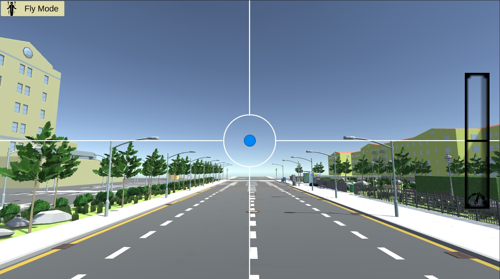
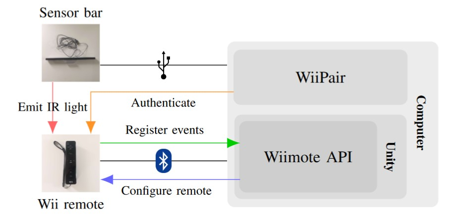

# WiiFly: 3D Navigation with a Wii Remote

Our work involves an innovative extension of the Wii remote functionalities, transforming it into an intuitive interface for users to navigate in sophisticated 3D navigational systems, encompassing a 5-DOF control mechanism.



## Table of Contents

- [License](#license)
- [Features](#features)
- [Architecture](#architecture)
- [Requirements](#requirements)
- [Getting Started](#getting-started)
  - [Installation](#installation)
  - [Usage](#usage)
- [Controls](#controls)
- [Game Flow](#game-flow)
- [Implementation Details](#implementation-details)
- [Contributing](#contributing)

## License

This project is licensed under the MIT License - see the [LICENSE](LICENSE) file for details.

Please **ACKNOWLEDGE THE AUTHOR** if you use this project in your own work. You can do this by including a link to this repository and the authors' GitHub profiles.

## Features

This approach was designed in accordance with a specific set of features:
- Enabling **5 degrees of freedom** (5-DOF) movement, as the Roll angle was discarded.
- Allowing users to switch between two distinct camera modes: **Fly mode**, granting unrestricted navigation in all directions and the ability to rotate independently, and **Orbit mode**, anchoring the user at an arbitrary center while enabling translation and rotation around it.
- Adhering to, at most, a **single trigger action**, considered to be any action with a binary state, such as keys or buttons.
- Providing users with the flexibility to dynamically **adjust the movement speed**.

## Architecture



## Requirements

The hardware of the WiiFly system comprises the following
components:
- **Wii remote (Wiimote)**: Input device controlling the WiiFly system. Equipped with gyroscope, accelerometer, an infrared cam-
era, and various buttons.
- **Sensor bar**: Specifically the Xahpower
USB Sensor Bar, with a total of six LEDs – three
on each side – it emits infrared (IR) light that allows the
Wii remote’s IR camera to determine the cursor’s position
precisely.

Regarding software, the WiiFly system relies on the follow-
ing elements:
- **Wiimote API**: The Unity Wii Remote API enables integration of the Wii remote capabilities within the Unity environment, establishing a communication channel between the Wii remote and the Unity application.
- **WiiPair**: The software application facilitates Bluetooth connection setup between the Wii remote and a computer. The Bluetooth link between the Wii remote is set up via the WiiPair software, sending an authentication token to maintain the connection.

### Installation

Clone the repository and open the project in Unity (version 2022.3.11f1).

### Usage

1. Turn the Bluetooth on your computer on.
2. Open the WiiPair application and press the 1 and 2 buttons simultaneously on the Wii remote.
3. Wait for the Wii remote to connect to your computer.
4. Open the WiiFly project in Unity.
5. Press the Play button in Unity.

## Controls

The WiiFly system is controlled by the Wii remote. The cursor’s position is determined by the IR camera, controlling the camera's angular speed. The distance between the sensor bar and the remote is used to determine the camera's linear speed.

## Project Structure

```python
WiiFly/
├── Assets/
│   ├── Editor/             # Custom editor scripts
│   ├── Scenes/             # Scenes of the project
│   ├── Scripts/            # Scripts of the project
│   │   ├── Camera/         # Scripts related to the camera
│   │   ├── Cursor/         # Scripts related to the cursor
│   │   ├── GUI/            # Scripts related to the GUI
│   │   └── Input/          # Scripts related to the input
│   ├── Sprites/            # Sprites of the project
│   ├── TAIM-Tests-Shared/  # Shared scripts for the TAIM tests
│   └── Wiimote/            # Wiimote API
├── Packages/               # Packages of the project
└── ProjectSettings/        # Project settings
```

## Acknowledgements

A special thanks to [Luís Guimarães](https://github.com/luismrguimaraes) and [Fabio Huang](https://github.com/FabioMiguel2000) for their efforts in developing the competing system [WeLeap](https://github.com/FabioMiguel2000/Leap-Motion-3D-Navigation). The development of both systems was carried out in parallel, with the goal of comparing the two approaches in a user study.
